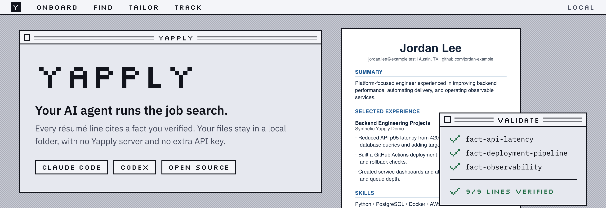
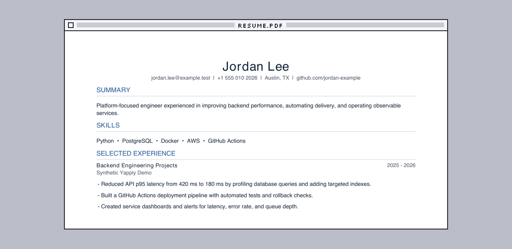
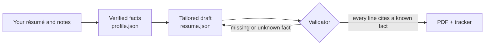

<p align="center">
  <picture>
    <source media="(prefers-color-scheme: dark)" srcset=".github/assets/banner-dark.png">
    
  </picture>
</p>

<p align="center">
  <a href="https://github.com/Faiz-k490/Yapply/actions/workflows/ci.yml"></a>
  
  <a href="LICENSE"></a>
  
  
  
  <a href="https://github.com/Faiz-k490/Yapply/stargazers"></a>
</p>

<p align="center">
  <b>Yap and apply.</b> Yapply turns Claude Code or Codex into a job-search assistant.<br>
  It finds roles, tailors your résumé, and tracks every application,<br>
  and it refuses to put a line on your résumé that isn't backed by a fact you verified.
</p>

<p align="center">
  <a href="#install">Install</a> ·
  <a href="#what-you-can-ask-for">What you can ask for</a> ·
  <a href="#how-it-stays-honest">How it stays honest</a> ·
  <a href="#by-the-numbers">By the numbers</a> ·
  <a href="#privacy-plainly">Privacy</a> ·
  <a href="#faq">FAQ</a>
</p>

## Install

**Claude Code.** Run these inside Claude Code:

```text
/plugin marketplace add Faiz-k490/Yapply
/plugin install yapply@yapply
```

Then try the demo, which uses a made-up person, so none of your data is involved:

```text
/yapply:try-yapply
```

**Codex.** The same skills ship with a Codex manifest in [`.codex-plugin/`](.codex-plugin/plugin.json).
<!-- codex-install: Codex install steps go here -->

**You need** Python 3.9 or newer (the one built into macOS works) and, for PDFs, the ReportLab package. If ReportLab is missing, the agent asks before installing it.

## What you can ask for

Talk to your agent normally. Yapply's five skills pick up the request.

| You say | Skill | What happens |
| :-- | :-- | :-- |
| "Show me how Yapply works" | `try-yapply` | Builds a fictional profile and job posting, validates them, and renders a sample résumé PDF. |
| "Set up Yapply with my résumé" | `onboard` | Breaks your résumé and notes into small facts, each with its own ID and evidence, in a private `.yapply/` folder. |
| "Find backend internships in NYC that sponsor visas" | `find-jobs` | Checks live postings, separates hard requirements from nice-to-haves, and ranks roles against your preferences. |
| "Tailor my résumé for this posting" | `prepare-application` | Drafts a résumé where every line cites your facts, validates it, renders a PDF, and walks you through each claim and its source. |
| "I applied to Acme" or "What's my pipeline?" | `track-applications` | Updates or summarizes your applications across 8 stages, from `saved` to `offer`. |

Yapply never submits an application or sends a message for you. It prepares the materials; you choose what to send.

## See it

This is the real output of `/yapply:try-yapply`. Every name, employer, and number in it is fictional.

<p align="center">
  <picture>
    <source media="(prefers-color-scheme: dark)" srcset=".github/assets/demo-dark.png">
    
  </picture>
</p>

## How it stays honest

AI résumé tools tend to invent things. Yapply keeps a record of where every line came from.



Each résumé line lists the IDs of the facts behind it:

```json
{
  "text": "Created service dashboards and alerts for latency, error rate, and queue depth.",
  "source_fact_ids": ["fact-observability"]
}
```

A line that cites nothing, or cites a fact that doesn't exist, fails validation, and the PDF won't render until it's fixed:

```text
Application northstar-platform-engineer has 2 error(s):
- resume.sections[0].items[0].bullets[3].source_fact_ids references unknown fact ID fact-team-lead
- resume.sections[0].items[0].bullets[4].source_fact_ids must contain at least one fact ID
```

The validator checks that the citations exist. Whether a fact really supports its sentence is up to the agent, which is told to cite only facts that directly back the claim and to show you every claim next to its source before you send anything.

## By the numbers

Every figure in this table is checked against the code by the test suite, so the README can't drift from what ships.

| Number | What it counts |
| --: | :-- |
| **0** | provider API keys needed |
| **0** | network requests the CLI makes on its own |
| **5** | agent skills |
| **2** | hosts: Claude Code and Codex |
| **8** | application stages tracked |
| **9/9** | demo résumé lines traced to one of 4 verified facts |
| **1** | dependency outside the Python standard library |
| **6** | allow-listed telemetry events |
| **Off** | telemetry, until you opt in |

Installed, Yapply adds about 400 tokens to each session, and a skill loads its full instructions only when you use it. The full demo, from an empty folder to a rendered PDF, takes about 0.2 seconds on an Apple Silicon Mac. The test suite runs on Python 3.9 through 3.14.

## Privacy, plainly

- **Your files stay in your folder.** Everything lives in `.yapply/` inside the directory you choose, and a generated `.gitignore` keeps it out of git.
- **There is no Yapply server.** The only thing that reads your files is the AI agent you already use, under that provider's terms.
- **Telemetry is off unless you turn it on.** Even then, events are limited to an allow-list of counts and status changes: no names, companies, job titles, URLs, file paths, or résumé text. You can preview the queue with `yapply telemetry preview`, and `DO_NOT_TRACK=1` overrides everything.

The full contract is in [PRIVACY.md](PRIVACY.md) and [docs/telemetry-contract.md](docs/telemetry-contract.md).

## FAQ

**Is it free?** Yes. It's MIT-licensed and runs on the Claude Code or Codex plan you already have.

**Will it apply to jobs for me?** No. It stops at `ready` and waits for you to say you applied.

**Can I use it without my real résumé?** Yes. `/yapply:try-yapply` runs entirely on fictional data.

**Where is my data?** In `.yapply/` in your working folder. Delete that folder and Yapply's copy is gone.

<details>
<summary><b>CLI reference</b></summary>

The skills call a small command-line tool that uses only the Python standard library, plus ReportLab for PDFs. You can run it yourself:

```bash
./bin/yapply init                      # create a private .yapply workspace
./bin/yapply status                    # profile readiness and pipeline totals
./bin/yapply validate-profile          # check facts and their IDs
./bin/yapply create-application acme-backend
./bin/yapply validate-application acme-backend
./bin/yapply render-application acme-backend
./bin/yapply track acme-backend applied
./bin/yapply --root /tmp/yapply-demo demo
./bin/yapply telemetry status
```

Commands use the current directory unless `--root PATH` comes before the subcommand. The workspace layout:

```text
.yapply/
├── config.json
├── profile.json        verified facts, identity, preferences
├── tracker.json        application stages
├── candidates.json     saved job leads
├── applications/<slug>/
│   ├── job.json
│   ├── resume.json
│   └── output/resume.pdf
└── telemetry/events.jsonl
```

</details>

## Contributing

Issues and pull requests are welcome. [CONTRIBUTING.md](CONTRIBUTING.md) covers setup, and the short version is:

```bash
python3 -m pip install -r requirements.txt
python3 -m unittest discover -s tests -v
python3 scripts/build_plugin.py --force
claude plugin validate dist/yapply --strict
```

To report a security or privacy problem, see [SECURITY.md](SECURITY.md).

## License

[MIT](LICENSE)
